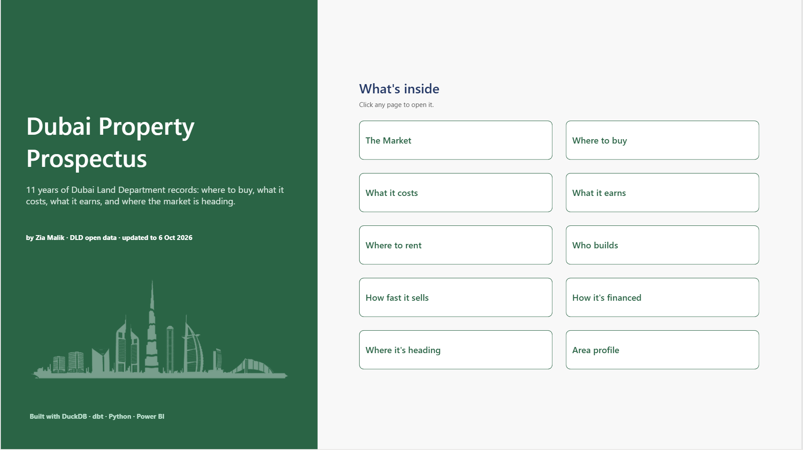
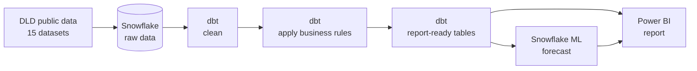
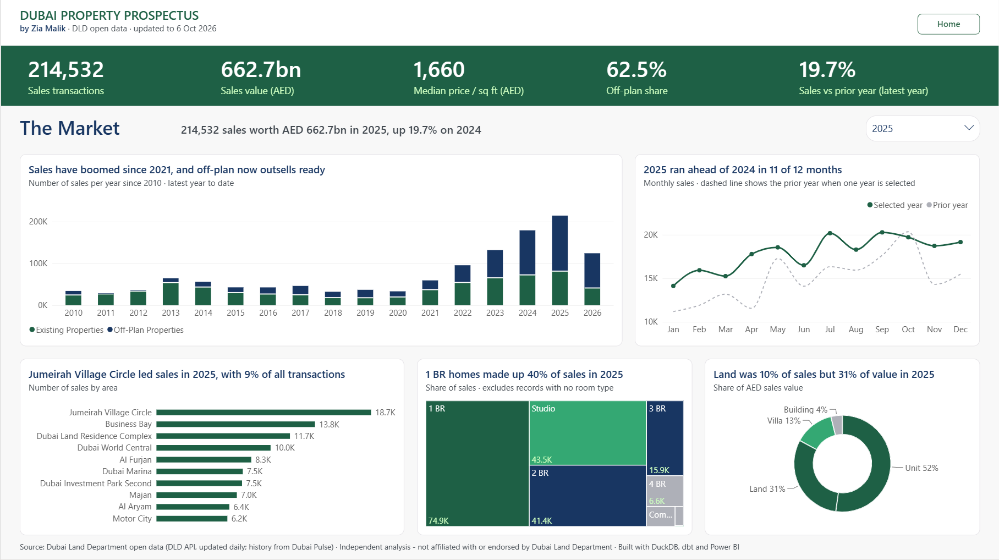
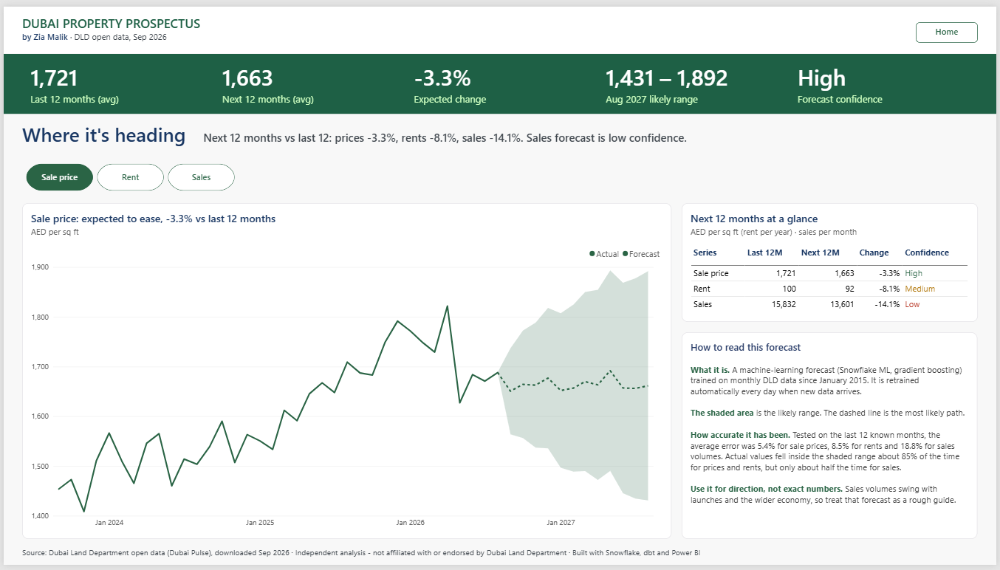

# Dubai Property Prospectus

I built this project to answer the questions people ask before buying or renting in Dubai: where to buy, what it costs, what it earns, who builds, how fast new projects sell, how buyers pay, and where the market is heading.

I used 11 years of public data from the Dubai Land Department (DLD) and built the full pipeline myself, from raw files to a finished Power BI report.

`Snowflake` · `dbt` · `Snowflake ML` · `Power BI` · `SQL` · `DAX`

---

## The project in numbers

| | |
|---|---|
| **Data** | 15 public datasets from Dubai Land Department, downloaded in September 2026 |
| **Size** | 1.8M property sales and transfers, 10.5M rent contracts, 2.4M registered units, 3,000+ projects |
| **Storage** | Snowflake |
| **Cleaning and modeling** | dbt, rebuilt automatically every day at 6 AM Dubai time |
| **Forecast** | Snowflake ML, retrained every day |
| **Report** | 11 pages in Power BI |

---

## What I found (2025)

- **A record year.** 214,537 sales worth AED 662.7bn, up 19.7% on 2024. Almost two out of three sales (62.5%) were off-plan.
- **Prices kept rising.** The typical home sold for AED 1,660 per sq ft, up 8.5%. Off-plan homes cost 32% more per sq ft than ready homes.
- **Rental returns are still good.** Ready homes returned 6.4% a year before costs and 5.4% after service charges. Tenants who renewed paid 28% less per sq ft than new tenants.
- **Lots of new supply, often late.** 865 projects with 382,625 homes are under way, and 329 of those projects are already past their planned end date.
- **New launches are selling more slowly.** Projects launched in 2025 sold 77% of their units in the first year. For 2022 launches it was 96%.
- **Mostly cash buyers.** For every 100 ready homes sold, only 49 home mortgages were registered.
- **Cooling ahead.** My forecast expects prices to ease 3.3%, rents 8.1% and sales volumes 14.1% over the next 12 months.

---

## How I built it

**Snowflake**
- I keep the raw data and the cleaned data in separate databases, so the original files are never changed.
- I set up three roles: one can only load data, one can only transform it, and one can only read the final tables. The report uses the read-only role.
- Each type of work runs on its own warehouse, so I can see what each step costs.
- Automated jobs log in with secure keys instead of passwords.

**dbt**
- **Step 1, clean:** one model per dataset. I fix data types, tidy up text and correct known errors in the source.
- **Step 2, business rules:** I flag sales, off-plan deals and bad prices, work out bedrooms from text, and group mortgages into clear categories.
- **Step 3, final tables:** fact and dimension tables for the report, plus special tables for rental yield, how fast projects sell, and the forecast.
- I wrote reusable macros for name cleaning, such as removing "LLC" or "FZE" from developer names.
- Tests check every build for missing values, duplicates and unexpected categories.
- Every change goes through a branch and a pull request before it reaches production.

---

## The report

| Page | The question it answers |
|---|---|
| **The Market** | How big is the market, and how is it changing? |
| **Where to buy** | Which areas give the best mix of price, growth and rental return? |
| **What it costs** | What do homes cost, and how much more is off-plan? |
| **What it earns** | How much rent can a landlord expect, after costs? |
| **Where to rent** | Which areas and home sizes fit my rent budget? |
| **Who builds** | Which developers build the most, and who finishes on time? |
| **How fast it sells** | How quickly do new projects sell out? |
| **How it's financed** | How many buyers use a mortgage, and how many pay cash? |
| **Where it's heading** | What will the next 12 months look like? |
| **Area profile** | Everything about one area on one page |

The titles and summaries on every page write themselves. When you change the year or the area, the headline updates, for example *"2025 ran ahead of 2024 in 11 of 12 months"*.

---

## Problems I found in the data, and how I fixed them

Government data is messy. These issues would have given wrong numbers if I had not caught them:

| What was wrong | What it would have caused | What I did |
|---|---|---|
| Project numbers were saved as decimals ("2615.00") in sales and rent records | None of the records matched the project list | Converted them to whole numbers. The match rate went from 0% to **96.5%** |
| Some projects had no completion date, and blank dates counted as "in the past" | **533** projects looked overdue instead of **329** | Left out blank dates when checking for delays |
| Many developers had no English name | Empty or Arabic-only names in the rankings | Used the name from the project record and removed legal endings like LLC and FZE |
| Resales of off-plan homes counted as new sales | Some projects looked more than 100% sold | Measured sales in each project's first 12 months only, capped at 100% |
| Some prices were zero or unrealistic | AED 18.6bn of wrong sales value | Flagged them and left them out of totals, averages and returns |
| Messy names and typos ("DownTown Dubai", "TOWN SQUARE", "FRIEZED") | Untidy and duplicated labels | Fixed the casing, keeping brand names like DAMAC and DMCC in capitals |
| Very small samples, such as a 5-bedroom rent based on a few contracts | Misleading figures | Hid results based on fewer than 10 contracts |
| Rent contracts with start dates as far out as 2030 | Charts running into future years | Time charts stop at the latest month with real activity |

---

## How I measure things

- **Price** is the median (middle) price per sq ft of valid home sales. I store areas in sq m and convert to sq ft in the report.
- **Rent** is yearly rent from new contracts for single homes. Renewals are compared separately.
- **Rental return (gross yield)** is the typical rent per sq ft divided by the typical price per sq ft. **Net yield** takes off service charges first.
- **Year-on-year** compares the same months in both years, so a part year is never compared with a full one.
- **First-year sales** is the share of a project's units sold in the 12 months after its first sale, for projects with 20+ units launched since 2015.

---

## The forecast

I built monthly figures from January 2015 for three things: number of sales, typical sale price and typical new rent. dbt trains a Snowflake ML forecast on them every day and saves the next 12 months with a likely range.

I tested it on the last 12 months I already knew:

| | Average error | How much to trust it |
|---|---|---|
| Sale price | 5.4% | High |
| Rent | 8.5% | Medium |
| Number of sales | 18.8% | Low |

The real values fell inside the likely range about 85% of the time for prices and rents, but only about half the time for number of sales. So the report treats the sales forecast as a rough guide only.

---

## How I checked the numbers

I checked every headline number on every page against Snowflake with my own SQL queries. When a number didn't match, I traced it back to how it was defined and either fixed it or made the definition clear.

---

## What's next

**Live data from the DLD API.** I have tested DLD's API: login, connection check, and sales, rent, unit and valuation data all work. Once I get production access, a daily job will load new records automatically, and the report will stay up to date without manual downloads.

---

## What's in this repository

- `models/`: the dbt models and their tests
- `macros/`: reusable cleaning code
- `model/sm_dubai_property.bim`: the Power BI data model (all tables, relationships and DAX measures)
- `report/dubai_property_prospectus.pdf`: the full report, all 11 pages
- `images/`: report screenshots

The Power BI file itself (.pbix) is 473 MB, too large for GitHub, so the PDF and model file are included instead.

---

*Data: Dubai Land Department public data (Dubai Pulse). This is my own independent analysis and is not linked to or approved by Dubai Land Department.*
